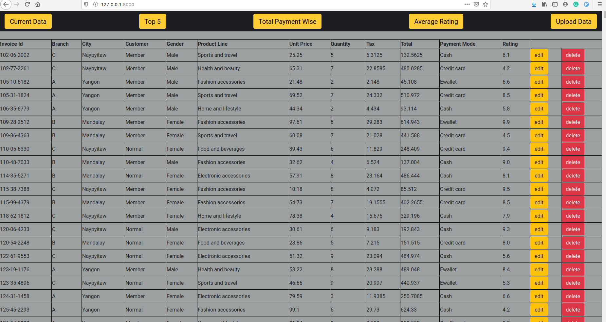
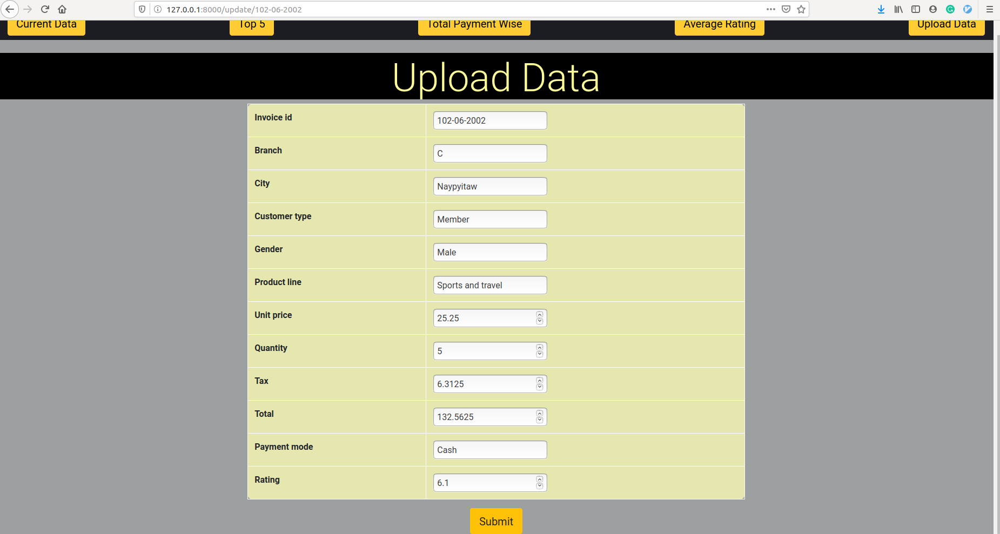
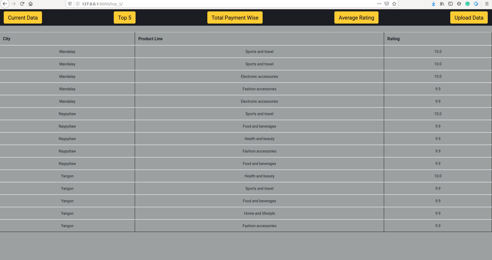
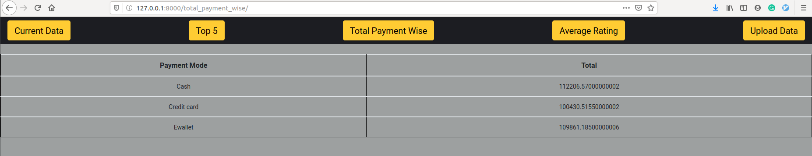
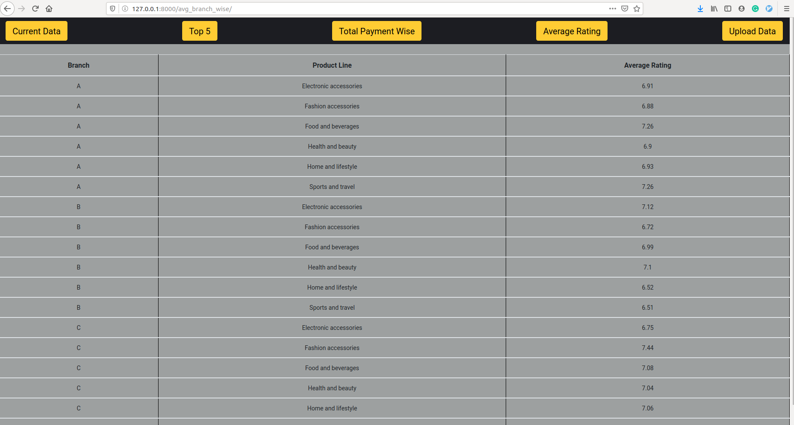

# Task_app
### Main page : 
Application name is TASK

# Question 1:  Make a Model in Django according to given and also provide CRUD functionality to it.
  As shown in above image, data is displaced with edit and delete functionality corresponding to each Invoice Id. Model named "Data" is created to implementit.
  On clicking edit following page opens :
  
  To delete any record, press delete button corresponding to it.
  
# Question 2: 
   ### 2.1 Top 5 highly rated product line city wise
   For each city, top ratings and their corresponding product line is displayed
   Output:    
   ### 2.2 Total Amount Payment mode wise
   Output: 
   ### 2.3 Average Product Rating of Each Product line Branch wise
   Output: 
   

  
